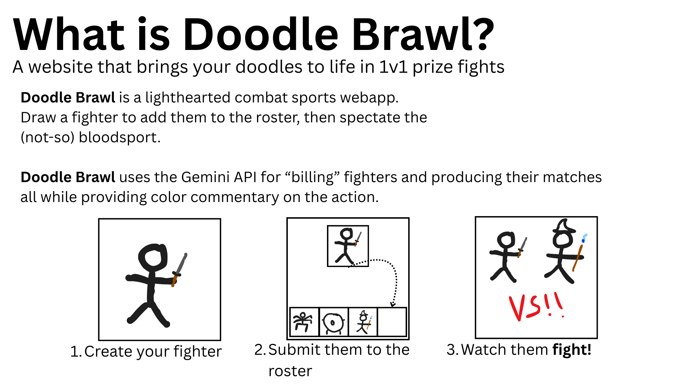
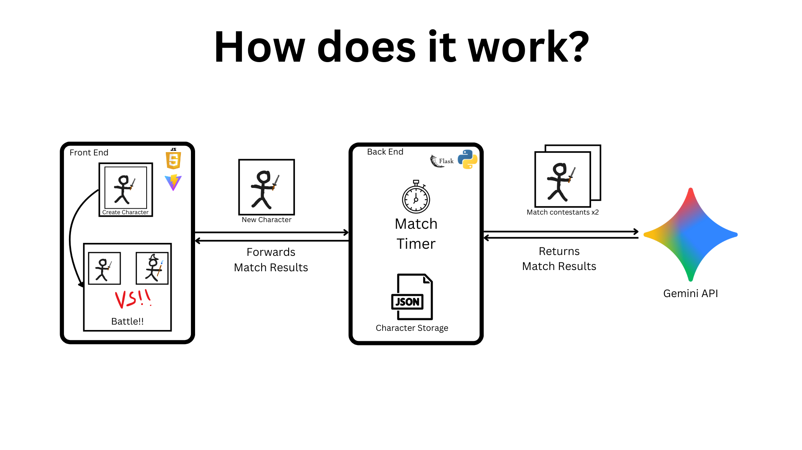
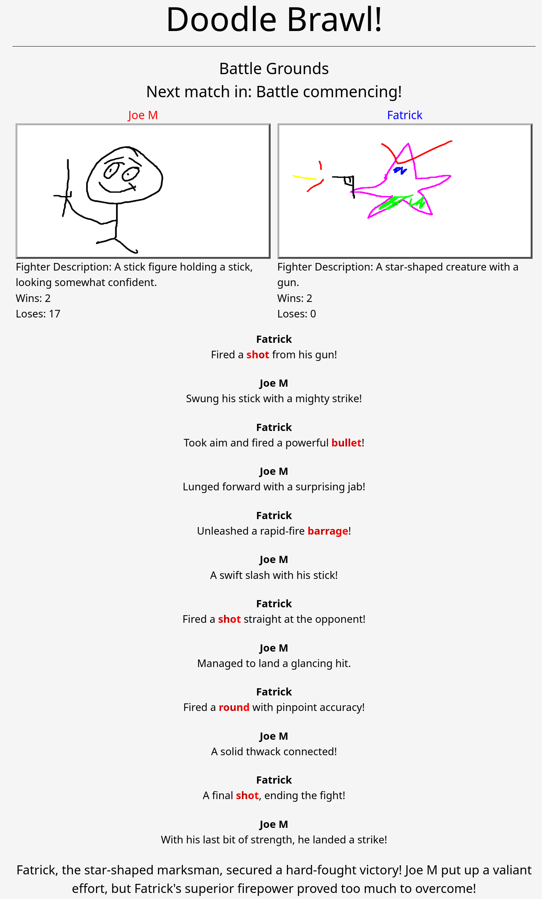
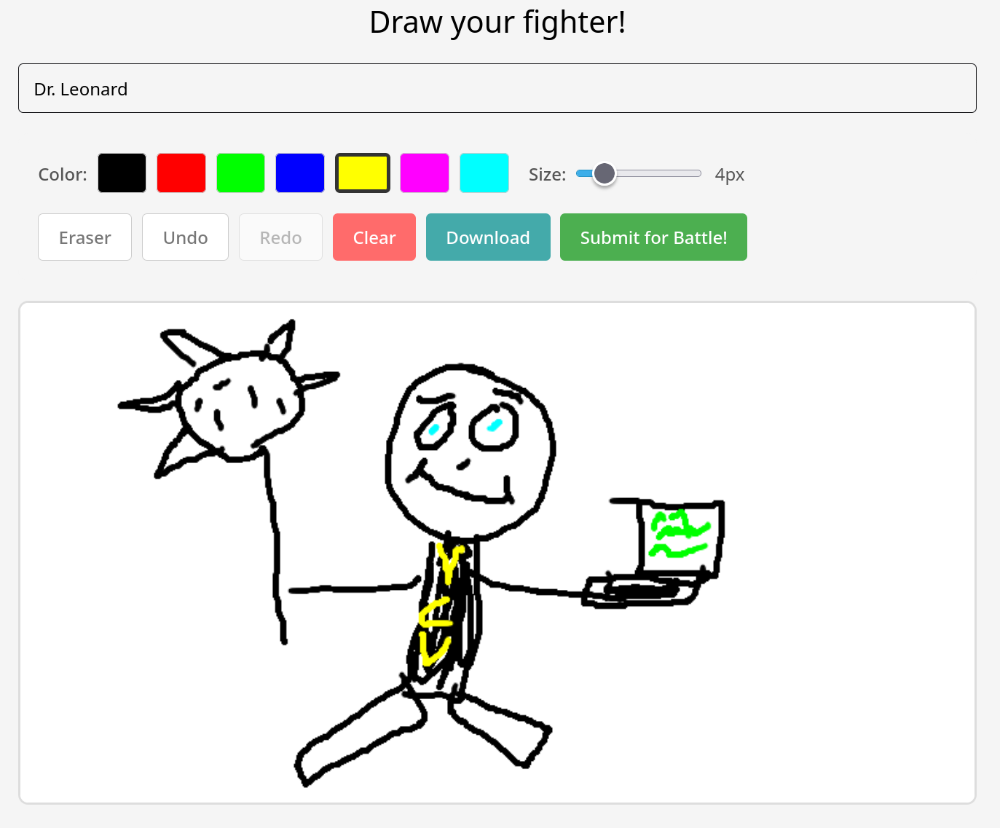

# Doodle Brawl

**[Play it here!](https://doodle.jfelix.space)**  

Made for the VCU 24 hour Hackathon - January 30th-31st 2026  
Due to Gemini API costs, the server will not usually be up.
Please consider hosting your own instance with the instructions below.

## Tech Stack
* Frontend
    * [React](https://react.dev/)
    * [Vite](https://vite.dev/)
* Backend
    * [Python](https://www.python.org/)
    * [Flask](https://flask.palletsprojects.com/)
    * [Google Gemini](https://ai.google.dev/gemini-api/docs)

## Description

## Screenshots

# How to Host

* Step 1: Obtain your Google Gemini API key
    * [Follow these instructions](https://ai.google.dev/gemini-api/docs/quickstart) to obtain your API key.
    It is free for personal use, with a modest daily limit (at the time of writing).
    * Copy `./env-example.txt` and name it `.env`. Then paste your API key into this file.

* Step 2: Start frontend
    * Requires [Node.js](https://nodejs.org) (tested on v22)
    * Run `npm install` inside of the `./frontend/` directory.
    * Run `npm run dev` to start a development server, this will open a local web server.
    * (Optional) build a production-ready website with `npm run build` and host yourself.

* Step 3: Start backend
    * Requires [Python](https://www.python.org/) (tested on v3.14) and [uv](https://docs.astral.sh/uv/)
    * Run `uv sync` inside of the `./Backend/` directory
    * Inside of `./Backend`, run `source .venv/bin/activate`
    * Inside of `./Backend`, run `python app.py`, this will open a local web server.

Steps 2 and 3 can be done in either order, the browser client will continually try to connect to the server until it is successful.

## Authors

* [Connor Fair](https://www.linkedin.com/in/connor-fair36/)
* [Jon Rutan](https://www.linkedin.com/in/jonathanrutan/)
* [Trevor Corcoran](https://www.linkedin.com/in/trevorcorc/)
